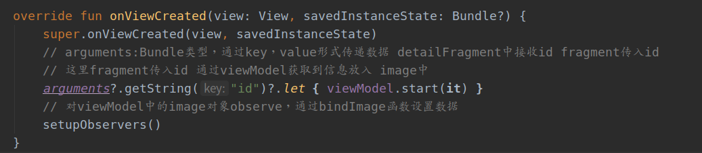

# Android & Kotlin：Retrofit + Hilt 实现 看妹子app

今天来学习一下android网络数据的访问，以及使用hilt dagger进行组件注入的实现。

## 0.效果展示


## 1. 依赖

使用到的技术栈：

+ Android studio 4.01
+ fragment
+ Retrofit
+ Lifecycle
+ Kotlin Coroutines
+ Hilt
+ Room
+ Navigation
+ Glide
+ Timber

完整dependencies如下：

```java
dependencies {
    implementation fileTree(dir: 'libs', include: ['*.jar'])
    implementation"org.jetbrains.kotlin:kotlin-stdlib-jdk7:$kotlin_version"
    implementation 'androidx.appcompat:appcompat:1.2.0'
    implementation 'androidx.core:core-ktx:1.3.1'
    implementation 'androidx.constraintlayout:constraintlayout:2.0.1'
    testImplementation 'junit:junit:4.12'
    androidTestImplementation 'androidx.test:runner:1.3.0'
    androidTestImplementation 'androidx.test.espresso:espresso-core:3.3.0'

    // fragment
    implementation 'androidx.fragment:fragment-ktx:1.2.5'

    //Retrofit
    implementation 'com.squareup.retrofit2:retrofit:2.9.0'
    implementation 'com.squareup.retrofit2:converter-gson:2.9.0'

    //Lifecycle
    def lifecycle_version = "2.2.0"
    implementation "androidx.lifecycle:lifecycle-viewmodel-ktx:$lifecycle_version"
    implementation "androidx.lifecycle:lifecycle-livedata-ktx:$lifecycle_version"
    implementation "androidx.lifecycle:lifecycle-common-java8:$lifecycle_version"
    implementation "androidx.lifecycle:lifecycle-extensions:$lifecycle_version"
    //noinspection LifecycleAnnotationProcessorWithJava8
    kapt "androidx.lifecycle:lifecycle-compiler:$lifecycle_version"

    //Kotlin Coroutines
    def coroutines_android_version = '1.3.9'
    implementation "org.jetbrains.kotlinx:kotlinx-coroutines-core:$coroutines_android_version"
    implementation "org.jetbrains.kotlinx:kotlinx-coroutines-android:$coroutines_android_version"

    //Hilt 依赖注入
    implementation 'com.google.dagger:hilt-android:2.28.1-alpha'
    implementation "androidx.hilt:hilt-lifecycle-viewmodel:1.0.0-alpha02"
    kapt 'com.google.dagger:hilt-android-compiler:2.28.1-alpha'
    kapt "androidx.hilt:hilt-compiler:1.0.0-alpha02"

    //Room
    def room_version = "2.2.5"
    implementation "androidx.room:room-runtime:$room_version"
    implementation "androidx.room:room-ktx:$room_version"
    kapt "androidx.room:room-compiler:$room_version"

    //Navigation
    def nav_version = "2.3.0"
    implementation "androidx.navigation:navigation-fragment-ktx:$nav_version"
    implementation "androidx.navigation:navigation-ui-ktx:$nav_version"

    //Glide 图片处理
    implementation 'com.github.bumptech.glide:glide:4.11.0'
    kapt 'com.github.bumptech.glide:compiler:4.11.0'

    //Timber
    implementation 'com.jakewharton.timber:timber:4.7.1'
}
```


## 2 主要实现

+ 通过Navigation实现Fragment 之间数据传递
+ Hilt 实现依赖注入
+ 访问数据实现网络本地访问策略


## 3. 数据服务

分为两部分：

+ 网络数据remote
+ 本地数据local

没有数据的话网络请求，并将数据放入android的sqlite数据库，再次请求的时候查看本地数据库中是否存在数据如果存在的话就直接在本地获取，如果不存在从网络获取。

#### 3.1 数据来源

数据来源： [干活集中营的api](https://gank.io/api)，api可以获取一些技术干货，也有一些福利妹子图片，本篇主要使用获取妹子图片这一部分

+ 看一下api内容：


+ 通过api内容写entity文件,获取自己需要的字段

```kotlin
/**
 * @author: ffzs
 * @Date: 2020/9/12 下午3:23
 */
@Entity(tableName = "image_data_table")
data class Image (
    @PrimaryKey
    val _id:String,
    val author:String,
    var url:String,
    val title:String,
    val desc:String,
    val likeCounts:Long,
    val views:Long,
)
```

+ 同时创建一个接收类，我们只需要获取response中的data：

```kotlin
/**
 * @author: ffzs
 * @Date: 20-9-12 下午8:15
 */

data class ImageList(
    val data:List<Image>
)
```

### 3.2 网络获取数据

+ 配置Retrofit


+ api接口获取20个小姐姐和一个小姐姐


+ 获取数据并进行封装为Resource逻辑，Response中数据->Resource
+ 由于获取的图片网址为http协议，需要换成https不然无法跳转

```kotlin
protected suspend fun <T> getResult(call: suspend () -> Response<T>): Resource<T> {
    try {
        val response = call()
        if (response.isSuccessful) {
            val body = response.body()
            body as ImageList
            // 将api获取的图片信息中http换为https不然无法完成跳转
            body.data.map {
                it.url = it.url.replace("http://", "https://")
            }
            Timber.i(body.toString())
            return Resource.success(body)
        }
        return error(" ${response.code()} ${response.message()}")
    } catch (e: Exception) {
        return error(e.message ?: e.toString())
    }
}
```

### 3.3 本地数据获取

本地使用Room完成对sqlite的操作，主要有功能实现如下：

+ 网络获取数据缓存到本地， 需要进行插入处理
+ 获取数据优先本地缓存中获取，并通过views进行排序

```kotlin
/**
 * @author: ffzs
 * @Date: 2020/9/12 下午3:28
 */
@Dao
interface ImageDao {

    @Query("SELECT * FROM image_data_table ORDER BY views DESC")
    fun getAllImages() : LiveData<List<Image>>

    @Query("SELECT * FROM image_data_table WHERE _id = :id")
    fun getImage(id: String): LiveData<Image>

    @Insert(onConflict = OnConflictStrategy.REPLACE)
    suspend fun insertAll(image_data_table: List<Image>)

    @Insert(onConflict = OnConflictStrategy.REPLACE)
    suspend fun insert(image: Image)
}
```

+ Room Database配置
+ 要加上`fallbackToDestructiveMigration()`不处理Migration的话升级版本会报错

```kotlin
/**
 * @author: ffzs
 * @Date: 2020/9/12 下午3:27
 */

@Database(entities = [Image::class], version = 4)
abstract class ImageDatabase :RoomDatabase(){
    abstract val imageDao: ImageDao

    companion object {
        @Volatile private var instance: ImageDatabase? = null

        fun getDatabase(context: Context): ImageDatabase =
            instance ?: synchronized(this) { instance ?: getInstance(context).also { instance = it } }

        private fun getInstance(appContext: Context) =
            Room.databaseBuilder(appContext, ImageDatabase::class.java, "image_data_table")
                .fallbackToDestructiveMigration()
                .build()
    }
}
```


### 3.4 获取数据

这里编写一个策略处理网络获取和本地获取的逻辑：

+ 本地获取成功，使用本地的，不成功网络获取并存储到本地
+ 这里传入的是三个方法

```kotlin
fun <T, A> performGetOperation(databaseQuery: () -> LiveData<T>,
                               networkCall: suspend () -> Resource<A>,
                               saveCallResult: suspend (A) -> Unit): LiveData<Resource<T>> =
    liveData(Dispatchers.IO) {
        emit(Resource.loading())
        val source = databaseQuery.invoke().map { Resource.success(it) }
        emitSource(source)

        val responseStatus = networkCall.invoke()
        if (responseStatus.status == SUCCESS) {
            saveCallResult(responseStatus.data!!)

        } else if (responseStatus.status == ERROR) {
            emit(Resource.error(responseStatus.message!!))
            emitSource(source)
        }
    }
```

+ 通过Repository统一编写处理逻辑

```kotlin
fun getImages() = performGetOperation(
    databaseQuery = { localDataSource.getAllImages() },
    networkCall = { webDataSource.getImages() },
    saveCallResult = { localDataSource.insertAll(it.data) }
)
```


## 4. Hilt 依赖注入

[hilt官网](https://dagger.dev/hilt/application)：

[android开发文档](https://developer.android.com/training/dependency-injection/hilt-android#setup)

两部分：

+ Hilt 启动类
+ Hilt 组件

启用插件需要将classpath添加到依赖中


### 4.1 Hilt 启动类

我们首先在根文件夹中创建一个从Application继承的类，以对其进行注释，以告知我们将在应用程序中使用Hilt。该类为Application类


当有了Application， 我们可以讲其他Android类中的启动成员注入，使用`@AndroidEntryPoints`注释。

`@AndroidEntryPoint`在以下类型上使用：

1. Activity
2. Fragment
3. View
4. Service
5. BroadcastReceiver


### 4.2 Hilt 组件注入

使用 @Provides 注入

您可以告知 Hilt 如何提供此类型的实例，方法是在 Hilt 模块内创建一个函数，并使用 `@Provides` 为该函数添加注释。

带有注释的函数会向 Hilt 提供以下信息：

- 函数返回类型会告知 Hilt 函数提供哪个类型的实例。
- 函数参数会告知 Hilt 相应类型的依赖项。
- 函数主体会告知 Hilt 如何提供相应类型的实例。每当需要提供该类型的实例时，Hilt 都会执行函数主体。


## 5. Fragment操作

通过Fragment以及navigation完成界面的切换


### 5.1 src/main/res/navigation/nav_graph.xml：

+ main中通过`FragmentContainerView`绑定到navigation
+ navigation实现两个界面的绑定
+ 通过一个action进行切换
+ 切换的同时将list中的id进行传递，detail中获取id后访问数据库获取数据进行展示

```xml
<?xml version="1.0" encoding="utf-8"?>
<navigation xmlns:android="http://schemas.android.com/apk/res/android"
            xmlns:app="http://schemas.android.com/apk/res-auto"
            xmlns:tools="http://schemas.android.com/tools"
            android:id="@+id/nav_graph"
            app:startDestination="@id/imageFragment"
>

    <fragment
            android:id="@+id/imageFragment"
            android:name="com.ffzs.imageapp.ui.images.ImageFragment"
            android:label="Images"
            tools:layout="@layout/image_fragment" >
        <action
                android:id="@+id/action_imageFragment_to_imageDetailFragment"
                app:destination="@id/imageDetailFragment" />

    </fragment>
    <fragment
            android:id="@+id/imageDetailFragment"
            android:name="com.ffzs.imageapp.ui.imagesDetail.ImageDetailFragment"
            android:label="Image Detail"
            tools:layout="@layout/image_detail_fragment" />
</navigation>
```


### 5.2 点击后触发onClickedImage

+ 通过ImageViewHolder继承View.OnClickListener，点击后触发onClick


### 5.2 传入id


### 5.3 获取id




## 6.debug

### 6.1 @AndroidEntryPoint to have a value. Did you forget to apply the Gradle Plugin?


### 6.2 java.lang.IllegalStateException: A migration from 1 to 2 is necessary. Please provide a Migration in the builder or call fallbackToDestructiveMigration in the builder in which case Room will re-create all of the tables.


## 7.源码


github